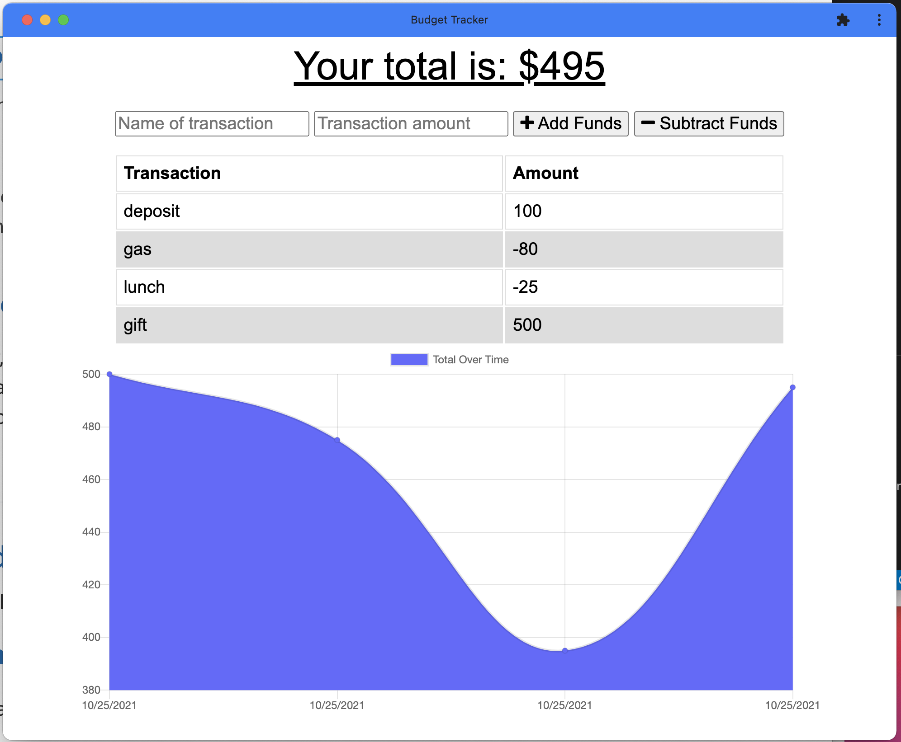

# My-Budget-Tracker[](https://opensource.org/licenses/MIT)
​
The budget tracker application that allows offline access and functionality.
​
## Technologies Used

* Express.js 
* MongoDB 
* Mongoose

## Description 

 This app allows the user to add expenses and deposits to their budget with or without a connection. If the user enters transactions offline, the total will be updated when they're brought back online.

```
GIVEN a budget tracker without an internet connection
WHEN the user inputs an expense or deposit
THEN they will receive a notification that they have added an expense or deposit
WHEN the user reestablishes an internet connection
THEN the deposits or expenses added while they were offline are added to their transaction history and their totals are updated
```
## Table of Contents 
- [Deployed](#deployed)
- [License](#license)
- [ScreenShot](#screenshot)
- [Questoins](#questions)

## Deployed

https://ig-budget-tracker.herokuapp.com/


## License 
  
  The MIT License


## ScreenShot
  
   |  
   
## Questions
If you hane any questions:
  
  Get in touch with me on Github [Irina-Golubitsky](https://github.com/Irina-Golubitsky)
  
  Email me irina.golubitsky@gmail.com
